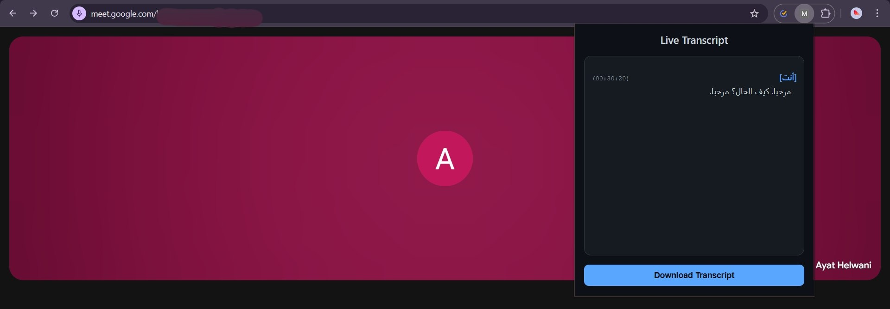
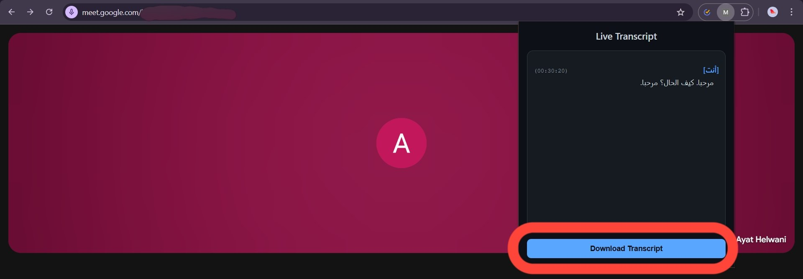

# Google Meet Captions Extractor

This project is a Chrome Extension that allows users to automatically capture captions from Google Meet and download them for later use.

## How to Install and Run

1. **Download the Project**
   - Download or clone this repository to your computer.

2. **Open Chrome Extensions Page**
   - Open Chrome and go to: `chrome://extensions/`

3. **Enable Developer Mode**
   - Toggle the switch **Developer mode** at the top right.

4. **Load the Extension**
   - Click on **Load unpacked**.
   - Select the folder where you downloaded the project.

5. **Start Using**
   - Open Google Meet and turn on captions.
   - Click the **Extensions icon** (puzzle piece) in the Chrome toolbar.
   - Select the **Captions Extractor** extension from the list.
   - A small interface will appear showing the live captions.
   - You can then save or download the captured text.

## Features
- Automatic caption capturing in Google Meet.
- Simple interface accessible from the Chrome extensions menu.
- Ability to download captured captions as text.

## Screenshots

Here’s a quick look at the extension in action:

*The extension popup showing captured captions.*

*Download the extracted captions with one click.*
